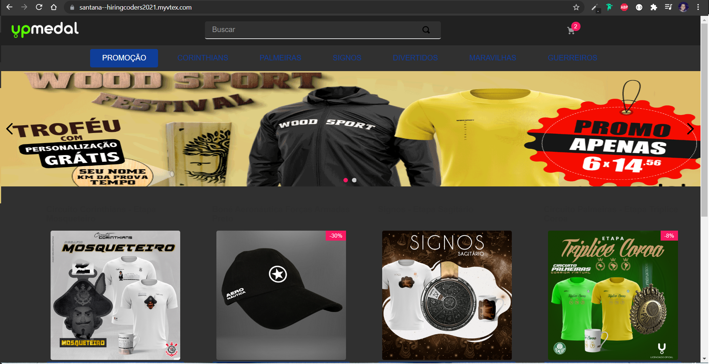

# Hiring Coders Challenge | VTex & Gama Academy

Desafio#3 - VTEX IO + AWS

Você foi contratado para desenvolver o ecommerce do
seu novo cliente, a UPMedal.com.

Seguindo o briefing para desenvolvimento:
Template de criação

- Criar a solução a partir de um boiler template padrão da Vtex IO.

Obs.: Gostaria de ter mais tempo para completar o que faltou, como estilização, retornar os preços no card o product.summury e utilizar a api da AWS.
